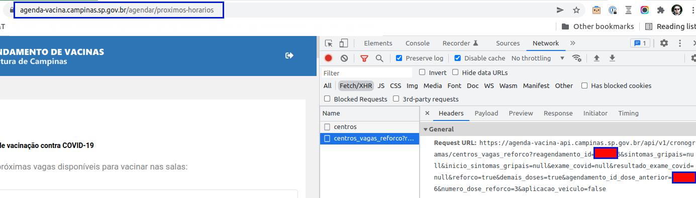
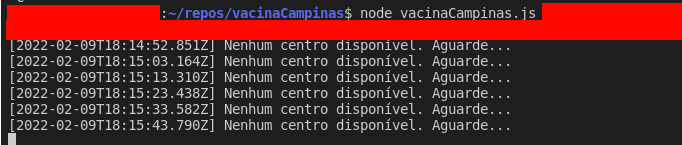
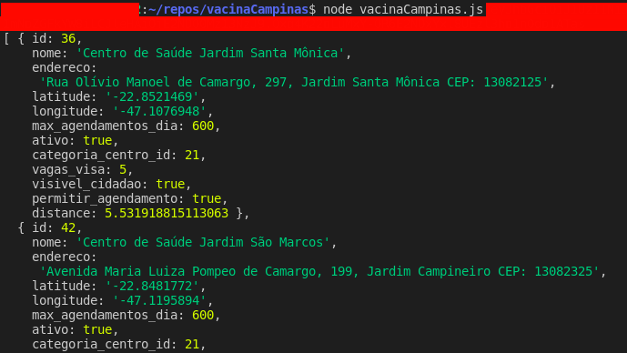

# vacinaCampinas Script
Este script foi criado para ajudar a encontrar vagas disponíveis para vacinação em Campinas.
## Problema que ele visa resolver:
A ideia desse script é buscar quais os centros nos quais existem vagas disponíveis para agendamento e calcular a distância entre o local configurado pelo usuário e o centro e filtrar apenas aqueles que estão dentro do raio definido.
## Possíveis outras soluções:
Daria para fazer de outro jeito? Possivelmente. Talvez usando um Puppeteer ou outro automatizador de rotinas de página Web. Mas achei interessante fazer desse jeito.
## Como ele funciona
Como é uma versão muito simples, existem alguns elementos que precisam ser fornecidos pelo usuário e requerem algumas habilidades de desenvolvimento, como por exemplo buscar as informações que são fornecidas depois da autenticação no portal da prefeitura.

Eu vou dar umas instruções básicas aqui, mas caso tenha dúvidas me procure.

Para você acessar o portal da Prefeitura de Campinas acesse https://agenda-vacina.campinas.sp.gov.br/.

E como é uma versão básica, ele não foi criado para funcionar em qualquer situação, nem para abusar do sistema da prefeitura e espero que ele seja usado só para facilitar para quem gostaria de se vacinar em Campinas e encontrar um centro de vacinação que esteja dentro da sua região.
## Testes
Sorry....
## Configuração
O script depende de um arquivo de configuração chamado config.json. Nele temos algumas sessões que o usuário vai precisar configurar antes de começar a pesquisa:

- **currentPosition** (latitude & longitude): É necessário informar qual é Lat & Long do local de onde se deseja calcular a distância. Pode ser sua casa, seu trabalho ou qualquer outro ponto de referência. Essa informação pode ser conseguida facilmente no Google Maps.
- **maxKmDistance**: Aqui é necessário informar a distância máxima que você deseja percorrer até o Centro de Vacinação. Essa distância é em linha reta. Não existe nenhuma integração com o Google Maps para fazer um cálculo mais acurado.
- **campinasVaccinationURLs**: URLs para consultar dados da Prefeitura de Campinas
- **lostDoseAppointmentId**: Informação que vem da consulta da Prefeitura (não sei exatamente o que significa. Mas você consegue depois da autenticação.)

## Como executar
Você precisa ter uma versão do Node instalado (eu estou usando o v10.20.1).
- Instalar dependencias: ```npm install```
- Executar a aplicação: ```node vacinaCampinas.js {token} {reagendar}```
**{token}**: Você consegue obter o token inspecionando o request depois da autenticação.
**{reagendar}**: Envie o valor "reagendar" caso queira buscar o reagendamento
## Resultados
Enquanto a busca não retornar nenhum resultado válido o log será apresentado da seguinte forma:

E quando algum centro é identificado o resultado é assim:

## Melhorias
Eu não explorei as APIs da prefeitura, mas talvez fosse possível explorá-las e ver quais outras integrações são possíveis.
É possível ver que alguns parâmetros são aceitos, talvez explorar para ver se é possível fazer a pesquisa mais facilmente.
Outro ponto é algum tipo de integração com o Google Maps para fazer uma busca mais precisa por tempo/distância ou até uma interface gráfica mais amigável.